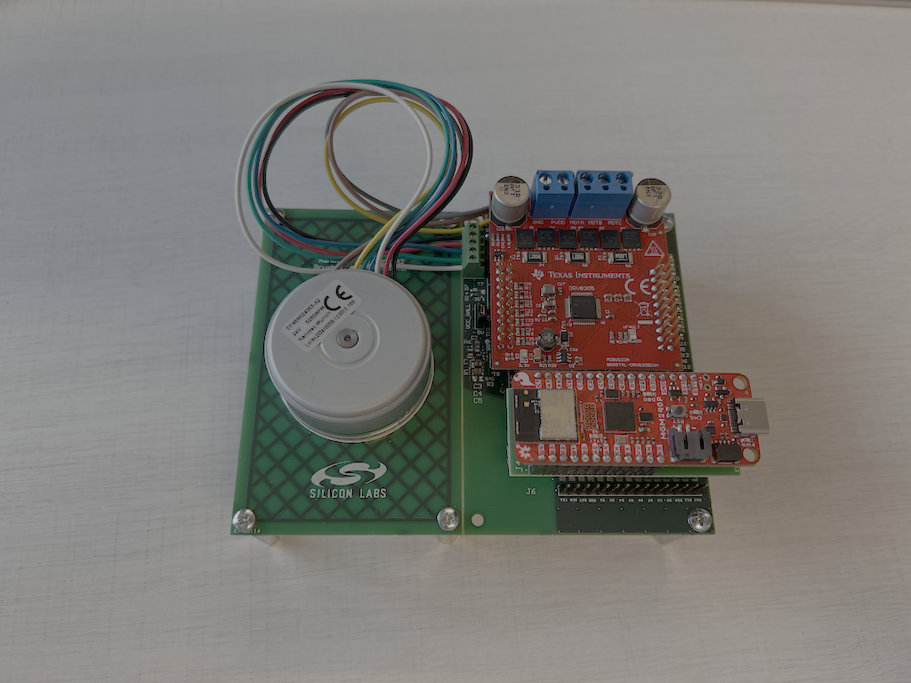

# Silabs SimpleFOC motor control with BLE example
This repository contains the example application to demonstrate the SimpleFOC closed loop speed control operation with BLE communication. The application accepts BLE connection from a mobile phone and receives commands via Serial Profile Protocol (SPP).

## Hardware requirements
* **[Arduino Nano Matter (EFR32MG24)](https://docs.arduino.cc/hardware/nano-matter/)** or **[SparkFun Thing Plus Matter](https://www.sparkfun.com/sparkfun-thing-plus-matter-mgm240p.html)**
* **DRV8305 BoosterPack (BOOSTXL-DRV8305EVM)**
* **BLDC Motor: DF45M024053 – A2**
* USB cable for programming and serial monitor

## Hardware Setup

### Arduino Nano Matter
A dedicated interface board setup connecting the Motor - Power Stage - Nano Matter. Jump wires can be used as well to connect the boards.


Connect the Arduino Nano Matter board to the DRV8305EVM according to the board pin mapping (phase outputs, PWM inputs, and Hall sensor connections).


### Wiring Table: Arduino Nano Matter to BOOSTXL-DRV8305 & BLDC Motor

This table describes the connections between the Arduino Nano Matter, the TI BOOSTXL-DRV8305 driver board, and a 3-phase BLDC motor with Hall sensors.

| From (Nano Matter Pin) | To (DRV8305 BoosterPack Pin) | BLDC MOTOR | Function / Description |
| :--- | :--- | :--- | :---|
| `3.3V` | `3V3` | HALL/ENC Supply*  | 3.3V Power; the BoosterPack provides 3.3V through an LDO |
| `GND` | `PowerSupply GND` | HALL/ENC sensor GND | Common Ground |
| N/A | `PowerSupply 24V` | N/A | Power supply for power stage 4.4 to 45 V, consider motor power|
| `A0`  | `ISENA` | N/A | Phase A current sense |
| `A1`  | `ISENB` | N/A | Phase B current sense |
| `A2`  | `ISENC` | N/A | Phase C current sense |
| `A3`  | `VSENA` | N/A | Phase A Voltage sense (Optional, not mandatory to run examples) |
| `A4`  | `VSENB` | N/A | Phase B Voltage sense (Optional, not mandatory to run examples) |
| `A5`  | `VSENC` | N/A | Phase C Voltage sense (Optional, not mandatory to run examples)|
| `A6`  | `VSENVPVDD`   | N/A | DC BUS Voltage sense (Optional, not mandatory to run examples)|
| `A7`  | `nFAULT` | N/A | Fault indicator, specific FAULT status can be obtained through the status registers |
| `D0` (MOSI1)  | `SDI` | N/A | DRV8305 SPI connection, configuration and status reading (Optional, not mandatory to run examples)|
| `D1` (MISO1)  | `SDO` | N/A | DRV8305 SPI connection, configuration and status reading (Optional, not mandatory to run examples)|
| `D2` (SCK1)   | `SCLK`| N/A | DRV8305 SPI clock, configuration and status reading (Optional, not mandatory to run examples)|
| `D3` (SS1)    | `SCS` | N/A | DRV8305 SPI chip select, configuration and status reading (Optional, not mandatory to run examples)|
| `D4`  | N/A | HALL B or Encoder B | Motor sensor connection (Hall configuration in examples) |
| `D5`  | N/A | HALL A or Encoder A | Motor sensor connection (Hall configuration in examples) |
| `D6`  | `PWMHA` | N/A | PWM Phase A High-Side Gate Signal |
| `D7`  | `PWMLA` | N/A | PWM Phase A Low-Side Gate Signal |
| `D8`  | `PWMHB` | N/A | PWM Phase B High-Side Gate Signal |
| `D9`  | `PWMLB` | N/A | PWM Phase B Low-Side Gate Signal |
| `D10` | `PWMHC` | N/A | PWM Phase C High-Side Gate Signal |
| `D11` | `PWMLC` | N/A | PWM Phase C Low-Side Gate Signal |
| `D12` | `ENGATE` | N/A | Enable DRV8305 gate driver |
| `D13` | N/A | HALL C or Encoder Index | Motor sensor connection (Hall configuration in examples) |
| N/A | `PHASE U` | `PHASE U` | Motor phase connection |
| N/A | `PHASE V` | `PHASE V` | Motor phase connection |
| N/A | `PHASE W` | `PHASE W` | Motor phase connection |

**Important Notes:**
*   **Power:** Ensure the DRV8305's `PVDD` and `GVDD` jumpers are correctly set for your motor's voltage. The power supply should be rated at least twice the motor’s nominal power. The BoosterPack can supply the Nano Matter if it is not connected to USB.
* **Rotor sensor:** Some Encoder or Hall sensors might require 5V supply, ensure proper level shifting if required.
*   **SPI:** The SPI connection (`nSCS`, `SPI_CLK`, `SPI_MOSI`, `SPI_MISO`) is used to configure the DRV8305 driver IC (e.g., set gain, fault parameters). It is optional for the examples. The examples are using the default gate driver configuration. Only needed if you wish to change the default gate driver configuration (e.g., dead time, fault parameters).

### SparkFun Thing Plus Matter
A dedicated interface board setup connecting the Motor - Power Stage - SparkFun Thing Plus Matter. Jump wires can be used as well to connect the boards.



Connect the SparkFun Thing Plus Matter board to the DRV8305EVM according to the board pin mapping (phase outputs, PWM inputs, and Hall sensor connections).


### Wiring Table: SparkFun Thing Plus Matter to BOOSTXL-DRV8305 & BLDC Motor

This table describes the connections between the SparkFun Thing Plus Matter, the TI BOOSTXL-DRV8305 driver board, and a 3-phase BLDC motor with Hall sensors.

| From (SparkFun Thing Plus Matter) | To (DRV8305 BoosterPack Pin) | BLDC MOTOR | Function / Description |
| :--- | :--- | :--- | :---|
| `3.3V` | `3V3` | HALL/ENC Supply*  | 3.3V Power; the BoosterPack provides 3.3V through an LDO |
| `GND`  | `PowerSupply GND` | HALL/ENC sensor GND | Common Ground |
| N/A    | `PowerSupply 24V` | N/A | Power supply for power stage 4.4 to 45 V, consider motor power|
| `A0`   | `ISENA` | N/A | Phase A current sense |
| `A1`   | `ISENB` | N/A | Phase B current sense |
| `A2`   | `ISENC` | N/A | Phase C current sense |
| `A3`   | `VSENA` | N/A | Phase A Voltage sense (Optional, not mandatory to run examples) |
| `A4`   | `VSENB` | N/A | Phase B Voltage sense (Optional, not mandatory to run examples) |
| `A5`   | `VSENC` | N/A | Phase C Voltage sense (Optional, not mandatory to run examples)|
| `A6`   | `VSENVPVDD`   | N/A | DC BUS Voltage sense (Optional, not mandatory to run examples)|
| `A7`   | N/A | N/A | N/A|
| `A8`   | `nFAULT` | N/A | Fault indicator, specific FAULT status can be obtained through the status registers |
| `D0`   | N/A | HALL B or Encoder B | Motor sensor connection (Hall configuration in examples) |
| `D1`   | N/A | N/A | N/A |
| `D2`   | N/A | N/A | N/A |
| `D3`   | N/A | HALL A or Encoder A | Motor sensor connection (Hall configuration in examples) |
| `D4`   | `PWMHA` | N/A | PWM Phase A High-Side Gate Signal |
| `D5`   | `PWMLA` | N/A | PWM Phase A Low-Side Gate Signal |
| `D6`   | `PWMHB` | N/A | PWM Phase B High-Side Gate Signal |
| `D7`   | `PWMLB` | N/A | PWM Phase B Low-Side Gate Signal |
| `D8`   | `PWMHC` | N/A | PWM Phase C High-Side Gate Signal |
| `D9`   | `PWMLC` | N/A | PWM Phase C Low-Side Gate Signal |
| `D10`  | `ENGATE` | N/A | Enable DRV8305 gate driver |
| `D11`  | N/A | HALL C or Encoder Index | Motor sensor connection (Hall configuration in examples) |
| N/A    | `PHASE U` | `PHASE U` | Motor phase connection |
| N/A    | `PHASE V` | `PHASE V` | Motor phase connection |
| N/A    | `PHASE W` | `PHASE W` | Motor phase connection |

**Important Notes:**
*   **Power:** Ensure the DRV8305's `PVDD` and `GVDD` jumpers are correctly set for your motor's voltage. The power supply should be rated at least twice the motor’s nominal power. The BoosterPack can supply the SparkFun Thing Plus Matter if it is not connected to USB.
* **Rotor sensor:** Some Encoder or Hall sensors might require 5V supply, ensure proper level shifting if required.

---

## Software Setup

### Requirements

1. **Arduino IDE**

   * Use Arduino IDE **2.3.4 or later**.
   * [Download here](https://www.arduino.cc/en/software).

2. **Silicon Labs Arduino Core**

   * Open *Boards Manager* in Arduino IDE.
   * Search for *Silicon Labs* and install the latest version (**2.3.0** or newer).
   * If not found, add this URL under *Preferences → Additional Boards Manager URLs*:

     ```
     https://siliconlabs.github.io/arduino/package_arduinosilabs_index.json
     ```

3. **SimpleFOC**

    * Use SimpleFOC **2.3.6 or later**
      * *Note: At the time of writing the 2.3.6 version is not yet available. Use the development branch until the release. [Development branch](https://github.com/simplefoc/Arduino-FOC/tree/dev)*
      * *Download the development branch as a zip.*
      * *Unzip the downloaded library and copy the library folder ("Arduino-FOC-dev" or similar) to the Arduino library folder. (Arduino/libraries)*
      * *In this case the steps below are not needed.*
    * Open *Library Manager* in Arduino IDE.
    * Search and add *Simple FOC* library

4. **Silabs BLE Stack**

   * In Arduino IDE go to *"Tools/Protocol stack"* and select **BLE (Silabs)**

5. **(Optional) SimpleFOC Studio or web viewer**

   * For runtime tuning and monitoring.
   * [Docs](https://docs.simplefoc.com/studio)
   * [Enable Monitoring](https://docs.simplefoc.com/monitoring)

---

### Build

#### Build with Arduino IDE

1. Open the `.ino` file in Arduino IDE.
2. Select your **Arduino Nano Matter** or **SparkFun Thing Plus Matter** board.
3. Verify (Compile).

#### Build with Arduino-CLI
There are multiple ways to build the project.
- Use the **build-all.sh** to build the image for all the available boards
   - *Note: "build-all.sh clean" removes all the build directories*
- Use the **build.sh** from the project folder *(projects/efr32_ble_velocity_6pwm)* to build the image for all the available boards
   - *Note: You can build separate images with "build.sh nano_matter" or "build.sh thingplusmatter" commands*
   - *Note: You can remove the build directories with "clean.sh" script.*

#### Build with Docker
1. Install Docker: [https://docs.docker.com/engine/install/](https://docs.docker.com/engine/install/)
2. Build a docker image. (Default platform is x86_64, use "--platform=linux/amd64" if needed)
   ```bash
      docker build -t efr32-ble-velocity-6pwm-build-env:latest .
   ```
3. Run the docker image
   ```bash
      docker run --rm -v .:/workspace efr32-ble-velocity-6pwm-build-env:latest /bin/bash -c "cd /workspace && bash build-all.sh"
   ```
### Flash and Run

#### Arduino IDE

1. Open the `.ino` file in Arduino IDE.
2. Select your **Arduino Nano Matter** or **SparkFun Thing Plus Matter** board.
3. Compile & upload.
4. Open the Serial Monitor (115200 baud)
5. (Optional) Connect with monitoring tools.
    1. Modification of the example code is necessary to enable monitoring feature. *(Note: Monitoring decreases the performance)*
    2. [Enable Monitoring](https://docs.simplefoc.com/monitoring)

*Note: If step 3 was successful but nothing appears on the serial monitor the bootloader might be missing. Go to **Tools** and make sure OpenOCD is selected for the **Programmer**. To flash the bootloader use the **Burn Bootloader** option. After the process is done, continue with step 3.*

#### Arduino-CLI

1. (Optional) Setup udev rules to access openocd (Linux)
   - Add the following rule file to **/etc/udev/rules.d/93-arduino.rules**
      ```bash
      SUBSYSTEM=="usb", ATTRS{idVendor}=="2544", ATTRS{idProduct}=="0001", GROUP="plugdev", TAG+="uaccess"
      ```
   - Reload udev rules
      ```bash
      sudo udevadm control --reload-rules && sudo udevadm trigger
      ```
2. Program bootloader (target: **SiliconLabs:silabs:nano_matter** or **SiliconLabs:silabs:thingplusmatter**, port: serial port)
   ```bash
      arduino-cli burn-bootloader -b <target> -p <port> --programmer openocd
   ```
3. Upload sketch (target: **SiliconLabs:silabs:nano_matter** or **SiliconLabs:silabs:thingplusmatter**, port: serial port)
   ```bash
       arduino-cli upload -b <target> --build-path "/path/to/build/" -p <port> --programmer openocd
   ```


### Example Commands

Send commands to control the motor:

``` bash
M50    # Run clockwise at 50 rad/s
M-50   # Run counter-clockwise at 50 rad/s
M0     # Stop motor
```

Commands can be sent via the serial or the BLE interface. The command structures are the same on both interfaces.

#### BLE Connection Setup
Scan for BLE devices using **Simplicity Connect** application. In the list of detected devices, identify the one named in the format motor_xxyyzz, where xxyyzz corresponds to a portion of the device's Bluetooth address. The figure on the side shows an example of scanning the device we tested. To establish a connection with the device, the user must click the **Connect** button.


The device details are displayed in the adjacent image. Users may rename the Service and Characteristic fields for easier identification. To begin sending commands, choose the **Write** option. To receive messages from the device, enable the **Notify** option.


The image below illustrates the screen after selecting the Write option. At this point, users can input commands, as presented above, to be transmitted to the device for execution.
*Note: Append the value 0x0A (LF) or 0x0D (CR) at the end of the line to terminate a CLI command.*


---

## References

* [SimpleFOC Documentation](https://docs.simplefoc.com/)
* [Commander Interface](https://docs.simplefoc.com/commander_interface)
* [Arduino Nano Matter Manual](https://docs.arduino.cc/tutorials/nano-matter/user-manual/)
* [Silicon Labs Arduino Core](https://github.com/SiliconLabs/arduino)
* [SimpleFOC Studio](https://github.com/JorgeMaker/SimpleFOCStudio)
## Contributing
Please follow the [CONTRIBUTING](./.github/CONTRIBUTING.md) guideline.

## License
See the [LICENSE.md](./LICENSE.md) file for details.
